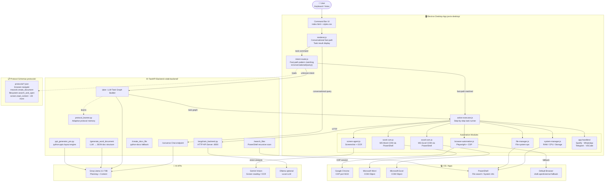

# Pecifics LAM — AI-Powered Desktop Automation Assistant

> **HackIndia XYZ · AI Agents Hackathon 2026**

Pecifics LAM (Large Action Model) is an intelligent desktop agent that understands natural language commands and executes multi-step workflows across your apps, browser, file system, and system tools — all from a lightweight floating UI built with Electron.

---

## What It Does

Pecifics LAM lets you control your entire computer by just typing or speaking what you want done.

| Say…                                    | Pecifics Does…                                                     |
|-----------------------------------------|--------------------------------------------------------------------|
| *"Open Figma"*                          | Opens figma.com in your browser instantly                          |
| *"Create a Word doc about climate change"* | Generates a structured multi-section `.docx` on your Desktop    |
| *"Make a PPT on machine learning"*      | Builds a styled multi-slide presentation via AI                    |
| *"Search for report.pdf"*               | Recursively scans your entire laptop and opens the file            |
| *"What's on my screen?"*                | Takes a screenshot and reads it back using vision AI               |
| *"What's on my clipboard?"*             | Reads and returns your current clipboard content                   |
| *"How much RAM do I have?"*             | Runs a PowerShell query and reports your memory stats              |
| *"Play Lo-Fi on Spotify"*               | Controls Spotify playback via the API                              |
| *"Send a WhatsApp to John"*             | Automates WhatsApp Web via browser CDP                             |

---
## Demo Video

[Watch the demo video](https://drive.google.com/file/d/1VjX6w8IFZ2H0dqEITYO9qqP08eeOivFV/view?usp=sharing)

---

## Key Features Added (This Session)

### 1. Conversational Query Routing
Non-task inputs (greetings, meta-questions like *"where did you search?"*, *"what did you just do?"*) are now detected by an `isConversationalQuery()` function and routed directly to a `/converse` backend endpoint — bypassing the task planner entirely so the assistant never confuses a casual question with an automation task.

### 2. System-Wide File Search
File search now scans the **entire laptop** by default — Desktop, Documents, Downloads, OneDrive, Pictures, Videos, Music, and the drive root. Implemented via a PowerShell recursive search with `$roots` targeting all common Windows profile directories.

### 3. Web App Navigation with Fallback
Commands like *"open figma"* or *"open notion"* are matched via a `SITE_SHORTCUTS` map and routed through `navigate_and_login`. If Playwright/CDP is unavailable, the action falls back to `shell.openExternal()` to open the URL in the default browser.

### 4. Word Document Creation (Resilient)
- Word documents are generated using an LLM-structured JSON plan (`/generate_word_document` endpoint).
- Written to `.docx` via Microsoft Word COM automation.
- If Word is not installed or COM times out (15s hard limit), a **python-docx fallback** creates the file directly on the backend.
- Typos in the topic (e.g. *"inux"* → *"Linux"*) are corrected via **Groq API** before content generation.

### 5. Screen Reading and Clipboard Fixed
- *"What is on my screen?"* now correctly triggers `read_screen` action (screenshot → vision API).
- *"What is on my clipboard?"* correctly reads clipboard text — no longer falsely returning a screenshot.
- Intent router regexes were refactored to unambiguously distinguish these two actions.

### 6. RAM & System Resource Queries
Queries like *"how much RAM do I have?"* / *"how much storage is left?"* are mapped to `system_info` action which runs PowerShell `Get-CimInstance`/`Get-WmiObject` queries and returns a formatted response.

---

## System Architecture



### Repository Structure

```
pecifics-lam/
├── blue-amoeba/              # Landing page (React + Vite + TailwindCSS)
├── colab-backend/            # FastAPI backend + LLM planner
│   ├── langchain_backend.py  # Main API server
│   ├── ppt_generator_pro.py  # Presentation AI engine
│   ├── voice_engine.py       # Clap detection + voice state
│   └── protocol_learner.py   # Adaptive protocol learning
├── jarvis-desktop/           # Electron desktop app
│   └── src/
│       ├── renderer/         # UI + intent router + renderer
│       └── modules/          # All automation modules
├── protocols/                # JSON action protocol schemas (25 protocols)
├── docs/                     # Architecture & developer docs
└── start_all.bat             # One-click launcher
```

### Command Flow

```
User Input
    │
    ├─ isConversationalQuery? ──YES──▶ /converse → Groq → reply shown in UI
    │
    └─ NO ──▶ intent-router.js fast-path match
                    │
           ┌────────┴──────────────────────┐
           │                               │
     Fast-path hit                 No match found
     file / screen / word /      → /plan → Groq LLM
     app / clipboard / RAM        → task graph JSON
           │                               │
           └────────────┬──────────────────┘
                        │
               action-executor.js
               (runs each action step)
                        │
            ┌───────────┴──────────────────┐
     Browser CDP / Word COM /       PowerShell /
     App Handlers / Screen AI       system-manager
                        │
                  Result → UI
```

---

## Tech Stack

| Layer               | Technology                                              |
|---------------------|---------------------------------------------------------|
| Desktop Shell       | Electron                                                |
| UI                  | Vanilla HTML / CSS / JS                                 |
| Backend API         | FastAPI (Python)                                        |
| LLM — Planning      | Groq API (Llama 3.3 70B)                                |
| LLM — Vision        | Google Gemini Vision                                    |
| Browser Automation  | Playwright (Chromium CDP)                               |
| Office Automation   | MS Word / Excel COM via PowerShell                      |
| Docx Fallback       | python-docx                                             |
| Presentation Engine | python-pptx (custom AI layout engine)                   |
| Landing Page        | React + Vite + TailwindCSS                              |

---

## Setup Instructions

### Prerequisites

- **Node.js** ≥ 18
- **Python** ≥ 3.10
- **Windows 10/11** (COM automation requires Windows)
- A **Groq API key** (free at [console.groq.com](https://console.groq.com))
- Optionally: **Gemini API key** for screen reading

---

### 1. Clone the Repo

```bash
git clone https://github.com/HackIndiaXYZ/ai-agents-hackathon-2026-supe.git
cd ai-agents-hackathon-2026-supe
```

---

### 2. Backend Setup

```bash
cd colab-backend

# Create and activate a virtual environment
python -m venv .venv
.venv\Scripts\activate   # Windows

# Install dependencies
pip install -r requirements_langchain.txt
pip install python-docx   # fallback Word doc generation

# Configure environment variables
copy .env.example .env
# Edit .env and fill in:
#   GROQ_API_KEY=your_groq_key
#   GEMINI_API_KEY=your_gemini_key  (optional, for screen reading)

# Start the backend
python langchain_backend.py
# → Runs on http://localhost:8000
```

---

### 3. Desktop App Setup

```bash
cd jarvis-desktop

npm install

# Start the Electron app
npm start
```

The floating assistant window will appear. Type any command to begin.

---

### 4. Landing Page (Optional)

```bash
cd blue-amoeba

npm install
npm run dev
# → Runs on http://localhost:5173
```

---

### 5. Quick-Start Script (All-in-One)

A convenience script is provided to start everything:

```bash
# From the project root
start_all.bat
```

This starts the backend and the Electron app together.

---

## Environment Variables

| Variable                       | Required | Description                                  |
|--------------------------------|----------|----------------------------------------------|
| `GROQ_API_KEY`                 | ✅ Yes   | LLM planning and content generation          |
| `GEMINI_API_KEY`               | ⚠️ Optional | Screen reading via Gemini Vision          |
| `PECIFICS_BACKEND_URL`         | ⚠️ Optional | Backend URL (default: `http://localhost:8000`) |
| `PECIFICS_CHROME_CDP_PORT`     | ⚠️ Optional | Chrome debug port (default: `9222`)        |
| `OLLAMA_URL`                   | ⚠️ Optional | Local Ollama model endpoint                |

---

## Known Issues

| Issue | Status | Notes |
|-------|--------|-------|
| Word COM hangs if MS Office not installed | ✅ Fixed | 15s timeout + python-docx fallback |
| "Open Figma" → `navigate_and_login` failure | ✅ Fixed | `shell.openExternal()` fallback |
| Clipboard query returning screenshot | ✅ Fixed | Intent routing regex corrected |
| File search only scanning project dir | ✅ Fixed | PowerShell now scans entire laptop |
| Conversational queries triggering task errors | ✅ Fixed | `isConversationalQuery()` bypass |
| System RAM query failing | ✅ Fixed | Mapped to `system_info` PowerShell action |
| Slow file search on large drives | ⚠️ Open | Recursive scan can take 5–15s |
| Web app automation (post-open) | ⚠️ Open | Requires Playwright CDP session to be running |

---

## License

MIT
