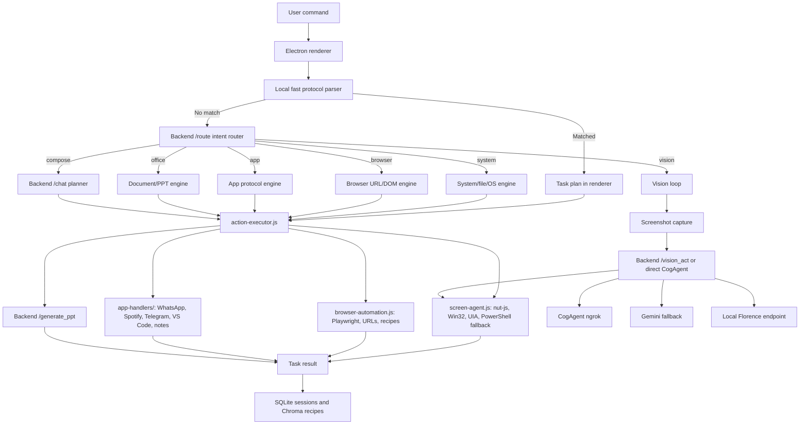

# Pecifics LAM Architecture

Last updated: 2026-05-30

This document describes the Pecifics Local Action Model (LAM) as it exists in this repository. It covers the project layout, runtime architecture, backend and frontend responsibilities, current feature set, command behavior, and the complete workflow from user input to planning, execution, vision control, verification, and learning.

Pecifics is currently moving from a vision-first desktop agent into a protocol-aware LAM: the assistant should understand the user's goal, choose the cheapest reliable execution method, compose known app/workflow primitives, execute them on the laptop, verify the result, and use vision only when deterministic methods are not enough.

## 1. Product Goal

Pecifics is a Windows desktop action assistant. The user gives natural language commands such as:

```text
open whatsapp and search for zainab csiot and msg her "hi , i am jarvis"
play avengers endgame any scene from youtube
create a ppt about photosynthesis
open chrome and go to gamma.app and create a ppt for me on photosynthesis
```

The LAM should:

1. Understand the requested work.
2. Extract parameters such as app, contact, message, topic, URL, file name, or form values.
3. Select the best execution engine.
4. Use known protocols for common apps and websites.
5. Execute through reliable primitives such as UI Automation, Playwright DOM, keyboard shortcuts, clipboard paste, Win32 focus, and file APIs.
6. Use CogAgent/Gemini/local vision only for unknown or visually ambiguous UI.
7. Verify or repair important steps.
8. Store successful workflows for reuse.

The intended operating principle:

```text
Use protocol/API first.
Use DOM/UIA before coordinates.
Use browser automation before vision.
Use vision only when state is unknown or no structured interface exists.
Ask the user when a task is risky or blocked.
```

## 2. Current High-Level Runtime



## 3. Repository Layout

```text
LAM/
  start_all.bat
  docs/
    ARCHITECTURE.md
    LAM_REARCHITECTURE.md
    SETUP.md
    TESTING.md
  colab-backend/
    langchain_backend.py
    ppt_generator_pro.py
    requirements_langchain.txt
    start_backend.bat
    CogAgent_Vision_Kaggle.ipynb
    memory_store/
      sessions.db
      user_profile.json
      chromadb/
  jarvis-desktop/
    package.json
    src/
      main.js
      preload.js
      renderer/
        index.html
        renderer.js
        intent-router.js
        command-bar.html
        command-bar.js
        command-bar.css
        status-hud.html
        status-hud.js
        status-hud.css
        styles.css
      modules/
        action-executor.js
        screen-agent.js
        browser-automation.js
        system-manager.js
        file-manager.js
        os-tasks.js
        safety-guard.js
        powerpoint-com.js
        word-com.js
        excel-com.js
        onenote-com.js
        publisher-com.js
        app-handlers/
          index.js
          whatsapp.js
          spotify.js
          telegram.js
          vscode.js
          notes.js
  blue-amoeba/
    marketing website
```

## 4. Frontend: Electron Desktop App

Location:

```text
jarvis-desktop/
```

The Electron app owns the user interface and local device execution.

Key files:

```text
jarvis-desktop/src/main.js
jarvis-desktop/src/preload.js
jarvis-desktop/src/renderer/renderer.js
jarvis-desktop/src/renderer/intent-router.js
jarvis-desktop/src/modules/action-executor.js
jarvis-desktop/src/modules/screen-agent.js
jarvis-desktop/src/modules/browser-automation.js
```

Responsibilities:

- Render chat, task cards, progress, settings, status, command bar, and status HUD.
- Run local fast protocol parsing before backend calls.
- Call backend `/route` for smart intent classification.
- Execute tasks through IPC and Node modules.
- Capture screenshots for vision tasks.
- Hide/show Pecifics during desktop automation so it does not steal focus.
- Maintain backend URL and CogAgent URL settings.
- Perform direct CogAgent health checks and reject false HTML/ngrok warning responses.
- Dispatch app/browser/system/document actions through `action-executor.js`.

## 5. Backend: LLM, Planning, Memory, Vision, PPT

Location:

```text
colab-backend/
```

Main file:

```text
colab-backend/langchain_backend.py
```

Responsibilities:

- `/health`: backend health and feature flags.
- `/route`: fast intent router for system/browser/app/office/vision/compose.
- `/chat`: full task planning fallback.
- `/vision_act`: vision action state machine.
- `/vision_act_local`: local Florence grounding endpoint.
- `/generate_ppt`: creates `.pptx` files through Python generation, not Office COM.
- `/verify`: checks task completion where configured.
- `/next_step`: self-correction and recovery suggestions.
- `/store_recipe` and `/query_recipe`: ChromaDB recipe memory.
- `/stream`: server-sent events for wake/proactive features.
- `/proactive_check`: proactive monitor hook.
- `/set_config`: runtime config such as CogAgent URL.

Health response example:

```json
{
  "status": "ok",
  "version": "4.0.0",
  "llm": "groq/llama-3.3-70b-versatile",
  "vision": "cogagent",
  "cogagent_url": "https://example.ngrok-free.app",
  "phase5": {
    "sqlite_sessions": true,
    "chroma": true,
    "langgraph": true
  }
}
```

## 6. Execution Engines

### 6.1 Local Fast Protocol Parser

File:

```text
jarvis-desktop/src/renderer/intent-router.js
```

This runs before `/route`. It is used only for high-confidence commands where local code already knows the safest path.

Current local fast protocols:

- WhatsApp message commands.
- Gamma presentation commands.

Example command:

```text
open whatsapp and search for zainab csiot and msg her "hi , i am jarvis"
```

Local plan:

```json
{
  "message": "Sending WhatsApp message to zainab csiot.",
  "tasks": [
    {
      "id": 1,
      "description": "Send WhatsApp message to zainab csiot: \"hi , i am jarvis\"",
      "actions": [
        {
          "name": "send_whatsapp_message",
          "parameters": {
            "contact": "zainab csiot",
            "message": "hi , i am jarvis",
            "send": true
          }
        }
      ]
    }
  ],
  "expected_result": "",
  "fast_path": true,
  "engine": "app"
}
```

### 6.2 Smart Intent Router

Backend endpoint:

```text
POST /route
```

The router classifies a command into one engine:

```text
system | browser | app | office | vision | compose
```

Example:

```text
play avengers endgame any scene from youtube
```

Route result:

```json
{
  "engine": "browser",
  "confidence": 0.98,
  "app_name": null,
  "operation": "play_video",
  "params": {
    "query": "avengers endgame any scene"
  },
  "fallback_engine": "browser"
}
```

### 6.3 System Engine

Used for:

- App launch and focus.
- File and folder creation.
- File search and reads.
- Clipboard operations.
- Volume, battery, disk, network, power, and system information.
- Shell commands when allowed by safety rules.

Main path:

```text
renderer.js
-> window.electronAPI.executeAction
-> action-executor.js
-> system-manager.js / file-manager.js / os-tasks.js / screen-agent.js
```

### 6.4 Browser Engine

File:

```text
jarvis-desktop/src/modules/browser-automation.js
```

Used for:

- Open URL.
- Google search.
- YouTube search and playback.
- DOM clicks and field typing.
- Page text extraction.
- Browser state checks.
- Gamma recipe attempts.

Important current behavior:

- `play_video` no longer uses CogAgent.
- It resolves the first YouTube result and opens a watch URL in the browser.
- Gamma automation is attempted through browser/DOM recipes and returns a blocker if login/onboarding/UI changes prevent progress.

### 6.5 App Protocol Engine

Files:

```text
jarvis-desktop/src/modules/app-handlers/index.js
jarvis-desktop/src/modules/app-handlers/whatsapp.js
jarvis-desktop/src/modules/app-handlers/spotify.js
jarvis-desktop/src/modules/app-handlers/telegram.js
jarvis-desktop/src/modules/app-handlers/vscode.js
jarvis-desktop/src/modules/app-handlers/notes.js
```

Path:

```text
renderer.js
-> action-executor.js action app_engine
-> app-handlers/index.js
-> specific app handler
```

The app protocol engine is the core of the new LAM direction. A protocol handler should expose reusable primitives, not one rigid command. The AI/router decides the capability and parameters; the handler performs reliable state-aware actions.

Current strongest protocol:

```text
WhatsApp Desktop send_message
```

### 6.6 Document/PPT Engine

Standard PPT creation does not require local Microsoft Office.

Path:

```text
/route -> office/generate_ppt
-> action-executor.generatePPT
-> backend /generate_ppt
-> ppt_generator_pro.py and python-pptx
-> .pptx saved to Desktop
```

Local Office COM modules still exist for advanced editing when Office is installed:

```text
powerpoint-com.js
word-com.js
excel-com.js
onenote-com.js
publisher-com.js
```

But normal commands such as `create a ppt about photosynthesis` use backend PPT generation, not COM automation.

### 6.7 Vision Engine

Vision is now fallback, not default.

Used for:

- Unknown UI.
- Screen description.
- "Click the visible button" where no DOM/UIA/protocol route exists.
- Arbitrary desktop app workflows.
- Visual ambiguity.

Providers:

- CogAgent via Kaggle/ngrok.
- Gemini when configured and quota permits.
- Local Florence endpoint for simple local grounding attempts.

Path:

```text
renderer executeVisionTask()
-> screenshot
-> direct CogAgent or backend /vision_act
-> action response
-> screen-agent executes
-> repeat until done/fail
```

Known constraint:

- CogAgent over ngrok is slow and URLs expire.
- Vision is much slower than protocols and should be used only when needed.

## 7. WhatsApp Protocol: Current Working State

File:

```text
jarvis-desktop/src/modules/app-handlers/whatsapp.js
```

Current status:

- The WhatsApp protocol can open/focus WhatsApp Desktop.
- It can search for `Zainab CSIOT`.
- It can select the correct contact through the WhatsApp `msedgewebview2` UI Automation tree.
- It can type the exact parsed message.
- The final send step now clicks the Send button instead of relying on Enter.

Current flow:

```text
1. Parse contact and message locally.
2. Ensure WhatsApp is open.
3. Hide Pecifics so it does not steal focus.
4. Focus WhatsApp window.
5. Press Escape to clear existing state.
6. Press Ctrl+F to open WhatsApp search.
7. Paste exact contact name.
8. Query the WhatsApp WebView accessibility tree.
9. Match the contact row by name.
10. Click the matched contact row.
11. Click message input.
12. Paste exact message.
13. Find/click Send button through UIA.
14. Fall back to coordinate send-button click if UIA cannot find it.
15. Restore Pecifics window.
```

Important fixes already made:

- Removed `Ctrl+N`; it can open the wrong WhatsApp UI.
- Uses `Ctrl+F` for search.
- Fixed `nut.Key.Escape` handling because this key is numeric `0`.
- Removed `ArrowDown + Enter`; it could select pinned chats.
- Uses `msedgewebview2` UIA tree because WhatsApp results are exposed there.
- Exact contact row was verified through UIA at a coordinate like `241,395`.
- Final send uses Send button click instead of Enter.

Expected user-visible output:

```text
Sending WhatsApp message to zainab csiot.
Task 1: Send WhatsApp message to zainab csiot: "hi , i am jarvis"
Action: send_whatsapp_message
Status: Done
```

Expected device behavior:

```text
WhatsApp opens/focuses.
Search field receives "zainab csiot".
The Zainab CSIOT contact row is selected.
Message input receives "hi , i am jarvis".
Send button is clicked.
```

## 8. Command Examples and Current Behavior

| User command | Route/engine | Main action | Expected Pecific output | Device behavior |
|---|---|---|---|---|
| `open whatsapp and search for zainab csiot and msg her "hi , i am jarvis"` | local fast protocol -> app | `send_whatsapp_message` | `Sending WhatsApp message to zainab csiot.` then task done | Opens/focuses WhatsApp, searches, selects contact through UIA, types exact message, clicks Send |
| `play avengers endgame any scene from youtube` | `/route` -> browser | `browser_play_video` | `Playing YouTube video for: avengers endgame any scene` | Resolves YouTube result and opens watch URL |
| `create a ppt about photosynthesis` | `/route` -> office | `generate_ppt` | `PPT created: C:\Users\adiin\Desktop\Photosynthesis.pptx` | Creates `.pptx` using backend generator |
| `open chrome and go to gamma.app and create a ppt for me on photosynthesis` | local Gamma plan or browser recipe | `gamma_create_presentation` | Starts workflow or returns blocker | Opens Gamma and attempts DOM-based creation |
| `search weather on google` | browser | `browser_search` | Browser task completed/opened search | Opens Google search results |
| `open notepad` | system/app | `open_application` | App opened | Opens Notepad |
| `set volume to 50` | system | `set_volume` | System task completed | Sets Windows volume |
| `create folder Test on Desktop` | system/file | `create_folder` | Folder created | Creates folder on Desktop |
| `show battery status` | system | `get_battery_status` | Battery info shown | Reads Windows battery status |
| `what is on my screen` | vision | screen analysis | Screen description | Captures screenshot and sends to vision provider |
| `click the blue button` | vision fallback | `vision_execute` | Vision task progress | Uses screenshot coordinates when no structured route exists |

## 9. Complete User Input Pipeline

### 9.1 Local Fast Path

```text
User command
-> renderer.js sendMessage()
-> intent-router.js buildPlan()
-> if matched, render task cards
-> executeTasks()
-> action-executor.js
-> relevant engine/protocol
```

Used for:

- High-confidence WhatsApp commands.
- High-confidence Gamma browser recipe commands.

### 9.2 Smart Router Path

```text
User command
-> renderer.js
-> POST /route
-> engine classification
-> direct engine dispatch
```

Used for:

- YouTube playback.
- Google/browser commands.
- System commands.
- PPT generation.
- App commands that are not handled locally.

### 9.3 Full Planner Path

```text
User command
-> /chat
-> prompt with action catalog, user profile, memory
-> tasks/actions JSON
-> renderer task cards
-> executeTasks()
```

Used when:

- The router chooses `compose`.
- The command needs multi-step planning.
- Local fast path and direct engine route are not enough.

### 9.4 Vision Path

```text
User command
-> route says vision or planner emits vision_task
-> screenshot
-> CogAgent/Gemini/Florence
-> action
-> screen-agent executes
-> wait/settle
-> repeat
```

Used when:

- UI cannot be reached through DOM/UIA/protocol.
- User asks visual questions.
- The app or screen state is unknown.

## 10. Memory and Learning

### 10.1 SQLite Session Memory

Location:

```text
colab-backend/memory_store/sessions.db
```

Purpose:

- Persist conversation history across backend restarts.
- Load recent context into `/chat`.

### 10.2 ChromaDB Recipe Memory

Location:

```text
colab-backend/memory_store/chromadb/
```

Endpoints:

```text
POST /store_recipe
POST /query_recipe
```

Purpose:

- Store successful action recipes.
- Retrieve similar workflows.
- Reduce repeated planning and repeated vision.

### 10.3 User Profile Memory

Location:

```text
colab-backend/memory_store/user_profile.json
```

Current and intended uses:

- Frequent contacts.
- Preferred file locations.
- App/browser preferences.
- Repeated workflows.
- Common recipients or topics.

## 11. Safety, Verification, and Error Handling

Safety components:

```text
safety-guard.js
action-executor.js validation
renderer task status/error reporting
protocol-level state checks
```

Current behavior:

- Renderer shows action errors in chat.
- `action-executor.js` blocks risky operations through `safety-guard.js`.
- WhatsApp protocol logs each step and returns the failed step if a primitive fails.
- Vision verification exists but is selectively used because remote vision is slow.

Risky operations that should require confirmation in production mode:

- Delete files or folders.
- Run shell commands.
- Shutdown/restart.
- Kill processes.
- Registry/security changes.
- Sending external messages or emails.
- Submitting forms or purchases.

## 12. OS Layer UI

Files:

```text
jarvis-desktop/src/renderer/command-bar.*
jarvis-desktop/src/renderer/status-hud.*
jarvis-desktop/src/main.js
```

Current UI direction:

- Pecifics can behave more like an OS layer than a normal app.
- A command bar can accept quick commands.
- A status HUD can show ready/thinking/executing state.
- The main chat/task view remains available for details and debugging.

This uses Electron windows, IPC, global shortcuts, tray behavior, and always-on-top windows. It does not replace the Windows shell.

## 13. How to Run

Backend:

```powershell
cd C:\Users\adiin\OneDrive\Desktop\LAM\LAM\colab-backend
..\.venv\Scripts\python.exe langchain_backend.py --host 127.0.0.1 --port 8000
```

Desktop app:

```powershell
cd C:\Users\adiin\OneDrive\Desktop\LAM\LAM\jarvis-desktop
npm run dev
```

CogAgent:

```text
Run colab-backend/CogAgent_Vision_Kaggle.ipynb on Kaggle GPU.
Paste the fresh HTTPS ngrok URL into Pecifics settings.
Use only the clean URL, for example:
https://example.ngrok-free.app
```

## 14. Current Strengths

- WhatsApp automation now works through a protocol path instead of CogAgent.
- YouTube playback works without vision.
- PPT generation works without local Office COM.
- Smart router separates system/browser/app/office/vision/compose.
- App-handler registry exists.
- `nut-js` native input is active.
- PowerShell fallback remains available.
- UIA is used for app structure where possible.
- Renderer reports exact action errors.
- Backend has SQLite session memory.
- Backend has ChromaDB recipe memory.
- Backend exposes local Florence and remote vision routes.

## 15. Current Constraints

- CogAgent ngrok URLs expire.
- CogAgent is slow compared with protocols.
- Gemini quota can block fallback vision.
- Browser workflows with login, onboarding, CAPTCHA, or account pickers can block.
- Gamma is not yet as reliable as WhatsApp.
- GUI actions cannot safely run in parallel because foreground focus, keyboard, and mouse are global.
- UIA trees vary by app version and rendering layer.
- Some actions still need stronger verification after execution.
- Message/email/form submission should have optional confirmation in production.

## 16. Next Architecture Upgrade: Protocol-Aware LAM

The next major upgrade is to formalize protocols as data, not only JavaScript code.

Recommended future structure:

```text
protocols/
  whatsapp.json
  youtube.json
  gamma.json
  google_forms.json
  gmail.json
  file_system.json
```

Example protocol shape:

```json
{
  "app": "WhatsApp",
  "capabilities": ["send_message", "search_contact", "open_chat"],
  "primitives": [
    "open_app",
    "focus_window",
    "search_contact",
    "select_contact",
    "focus_message_input",
    "type_message",
    "send"
  ],
  "state_checks": [
    "app_open",
    "contact_visible",
    "chat_open",
    "message_box_focused"
  ],
  "fallbacks": ["uia", "keyboard", "coordinate", "vision"],
  "verification": ["recipient_selected", "message_sent"]
}
```

The advanced LAM planner should do this:

```text
understand user goal
-> choose domain and protocol
-> extract parameters
-> inspect current state
-> compose primitive sequence
-> execute step by step
-> verify important state
-> repair or fall back
-> store successful recipe
```

This is the intended path from a scripted assistant toward a real laptop-friendly LAM: an AI planner that understands work, uses protocols and tools, falls back to vision only when necessary, and learns reliable workflows over time.
